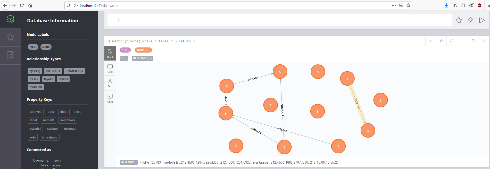

# IoTMap
IoTMap is a tool that models IoT networks using one or multiple protocols
simultaneously. This work is a part of my thesis and is in progress. Currently 3
protocols are supported (BLE, ZigBee, OS4I), but more protocols will be added
soon.

## Requirements :

### Python 3 requirements

* Python > 3.5
* Scapy (pip install scapy or via git using git clone
https://github.com/secdev/scapy.git && cd scapy && python setup.py install)
* neo4j-1.7.6
* docopt-0.6.2
* prompt-toolkit-3.0.5
* terminaltables-3.1.0
* pycryptodomex-3.9.7

You can use the requirements.txt file to install the packages with this command:
```
pip3 install -r requirements.txt
```

### OS libs

* libgcrypt20-dev (for KillerBee)
Depending on the system you used (debian-based OS, archlinux-based OS) you can
use:
```
sudo apt-get install libgcrypt20-dev # (for debian-based distrib)
sudo pacman -S libgcrypt             # (for archlinux-based distrib)
```

## Installation

This section describes how to install this project. The first thing is to clone
this repo, then install all requirements described above
```
# For any distrib
git clone https://github.com/AlgoSecure/iotmap.git
cd iotmap
sudo pip install -r requirements.txt

# If debian-based
sudo apt-get install libgcrypt20-dev

# If archlinux-based
sudo pacman -S libgcrypt
```

Now we gonna install Neo4J. You can install Neo4J from you packet manager if you want. For me, the simplest
way to install and use it is from the tarball. So if like me you choose this
option, you can follow those commands:
```
cd /path/to/iotmap
cd database

# You can replace the version number to the latest one in the URL
wget -O neo4j-community.tar "https://neo4j.com/artifact.php?name=neo4j-community-3.5.9-unix.tar.gz"
mkdir neo4j-community && tar xvf neo4j-community.tar -C neo4j-community --strip-components 1
```

## The first run

If it is the first run of the project, you need to define a username and a password for
the database. You must start the database with the following commands:
```
cd database
./neo4j-community/bin/neo4j console
```

Then go to the neo4j webpage at http://localhost:7474. The default username and
password are **neo4j** and **neo4j** respectively. If you don't want to modify
the values in iotmap you can set the username with **neo4j** and the
password with **iotmap**.

If you want to choose another couple of id, you must change the values in the
script **core/databaseController.py** at line 46
```
model = Model("bolt:http://localhost:7474", "username", "password")
```

## How to use this project

A more detailed documentation on how to use IoTMap with an example is available [here](doc/started.md)

To start the framework you have to run **python3 iotmap.py**. IoTMap will starts the neo4j database before running the project. However, after starting neo4j, the database is not immediately available. Sometimes the sleep of 10 seconds is enough for the database to be available sometimes not and you need to rerun iotmap. 

IoTMap provides 3 modules **Database, Modelling and Sniffing**. The sniffing module is a work in progress and not fully operational. To switch between modules, you can just hit the name of the module and iotmap switch to this module.

````
python3 iotmap.py
Starting the database
Database is available at http://localhost:7474/


IIIIIIIIII              TTTTTTTTTTTTTTTTTTTTTTTMMMMMMMM               MMMMMMMM
I::::::::I              T:::::::::::::::::::::TM:::::::M             M:::::::M
I::::::::I              T:::::::::::::::::::::TM::::::::M           M::::::::M
II::::::II              T:::::TT:::::::TT:::::TM:::::::::M         M:::::::::M
  I::::I     oooooooooooTTTTTT  T:::::T  TTTTTTM::::::::::M       M::::::::::M  aaaaaaaaaaaaa  ppppp   ppppppppp
  I::::I   oo:::::::::::oo      T:::::T        M:::::::::::M     M:::::::::::M  a::::::::::::a p::::ppp:::::::::p
  I::::I  o:::::::::::::::o     T:::::T        M:::::::M::::M   M::::M:::::::M  aaaaaaaaa:::::ap:::::::::::::::::p
  I::::I  o:::::ooooo:::::o     T:::::T        M::::::M M::::M M::::M M::::::M           a::::app::::::ppppp::::::p
  I::::I  o::::o     o::::o     T:::::T        M::::::M  M::::M::::M  M::::::M    aaaaaaa:::::a p:::::p     p:::::p
  I::::I  o::::o     o::::o     T:::::T        M::::::M   M:::::::M   M::::::M  aa::::::::::::a p:::::p     p:::::p
  I::::I  o::::o     o::::o     T:::::T        M::::::M    M:::::M    M::::::M a::::aaaa::::::a p:::::p     p:::::p
  I::::I  o::::o     o::::o     T:::::T        M::::::M     MMMMM     M::::::Ma::::a    a:::::a p:::::p    p::::::p
II::::::IIo:::::ooooo:::::o   TT:::::::TT      M::::::M               M::::::Ma::::a    a:::::a p:::::ppppp:::::::p
I::::::::Io:::::::::::::::o   T:::::::::T      M::::::M               M::::::Ma:::::aaaa::::::a p::::::::::::::::p
I::::::::I oo:::::::::::oo    T:::::::::T      M::::::M               M::::::M a::::::::::aa:::ap::::::::::::::pp
IIIIIIIIII   ooooooooooo      TTTTTTTTTTT      MMMMMMMM               MMMMMMMM  aaaaaaaaaa  aaaap::::::pppppppp
                                                                                                p:::::p
                                                                                                p:::::p
                                                                                               p:::::::p
                                                                                               p:::::::p
                                                                                               p:::::::p
                                                                                               ppppppppp


                                Version=0.1

IoTMap > help

Core commands
=============

 Commands  Description
------------------------------
 database  Use database mode.
 sniffing  Use sniffing mode.
 exploit   Use exploit mode.


IoTMap >
````
Each module and functions provide its help menu to list the functions available and how to use them.

### Database module
This module manages the neo4j database and can interact with it.
```
IoTMap > database
IoTMap database > help

Core commands
=============

 Commands  Description
------------------------------
 database  Use database mode.
 sniffing  Use sniffing mode.
 exploit   Use exploit mode.


Database commands
=================

        Interact with the neo4j database.

List of available commands :
        addNodes
        clearDatabase
        exportDB
        getNodes
        help
        importDB
        importPcaps
        mergeNodes
        removeNode

For more information about any commands hit :
        <command name> -h

IoTMap database > 
											
```

To populate the database you can import an existing database or import Pcaps. ImportPcaps converts Pcaps to our unified format used to generate the modelling. This program is a launcher that uses different extractors according to the protocol given in argument that you can find in the extractors folder. The main program chooses which extractor to use then runs the packets generator (gen_packets.py) in a multithreading way to generate the pcap with the unified format.

### Modelling module
```
IoTMap modelling > help

Core commands
=============

 Commands  Description
------------------------------
 database  Use database mode.
 sniffing  Use sniffing mode.
 exploit   Use exploit mode.


Modelling commands
==================

        Map the network of IoT devices detected by sniffing.

List of available commands :
        appGraph
        compareTo
        dlGraph
        help
        nwkGraph
        option
        run
        set
        transGraph

For more information about any commands hit :
        <command name> -h

IoTMap modelling >                   
```

This program starts the Neo4J database before creating the modelling. Once the
database is up, the modelling can begin. It starts with the analysis of the
pcap given in input to extract and create nodes then edges that link
nodes. After the 4 graphs created, the result can be viewed on the web
application provided by Neo4J and available at http://localhost:7474/

You can also request the database directly from the web application by using
cypher request in the input box.

